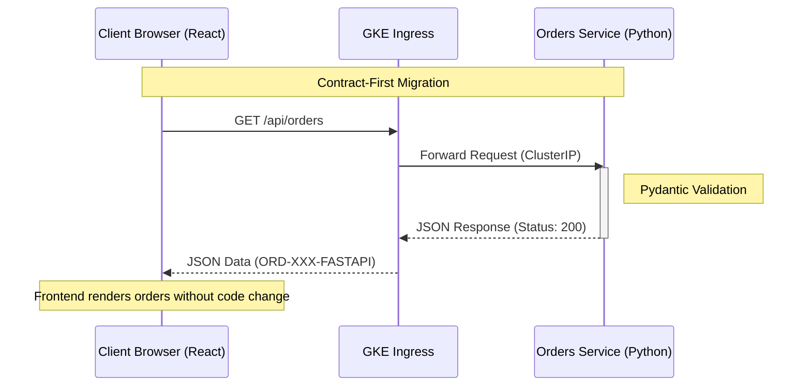
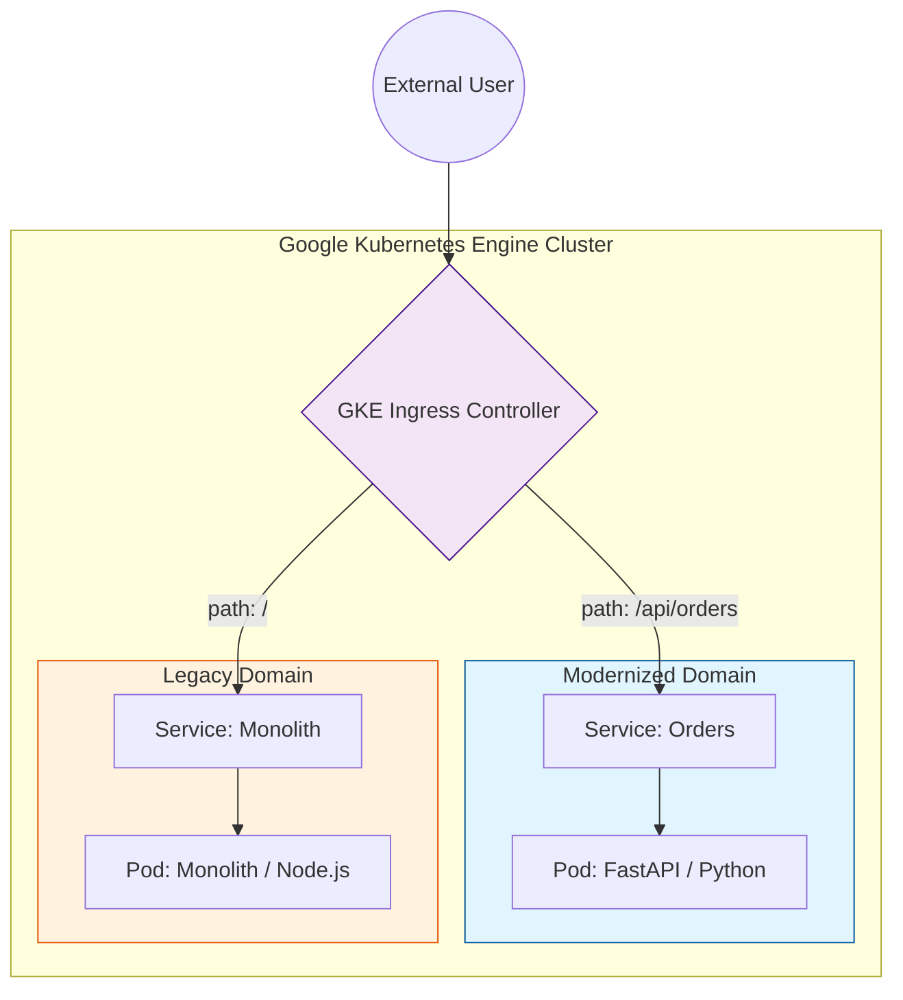
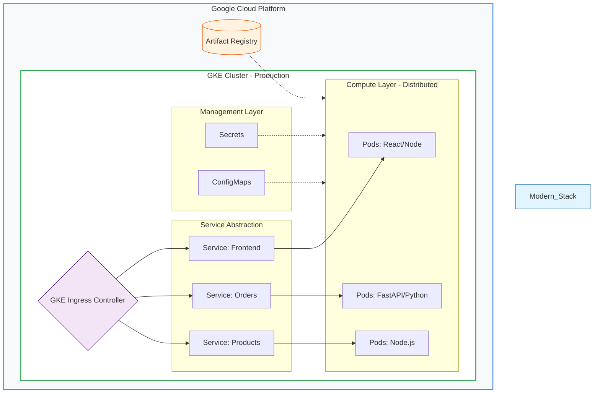
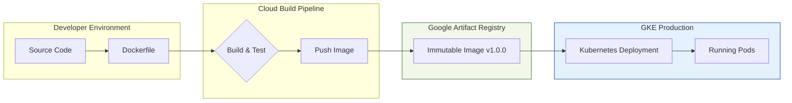

# Kubernetes Application Modernization on GKE
## From Monolith to Microservices – Architecture Patterns & Production Readiness
A decision-oriented architectural case study on migrating a Node.js monolith to a polyglot (FastAPI/Node.js) microservices environment on GKE using the Strangler Fig pattern.

---

## Table of Contents

1. [Executive Summary](#1-executive-summary)
2. [Problem Statement](#2-problem-statement)
3. [Initial Architecture (Monolith)](#3-initial-architecture-monolith)
4. [Target Architecture (Microservices on GKE)](#4-target-architecture-microservices-on-gke)
5. [Migration Strategy](#5-migration-strategy-strangler-fig-pattern)
6. [Key Architectural Decisions](#6-key-architectural-decisions)
7. [Observability and Day-2 Operations](#7-observability-and-day-2-operations)
8. [Tradeoffs and Limitations](#8-tradeoffs-and-limitations)
9. [Improvements and Next Steps](#9-improvements-and-next-steps)
10. [Key Takeaways](#10-key-takeaways)
11. [Technologies Stack](#11-technologies-stack)
12. [Target Audience](#12-target-audience)
13. [License](#13-license)

---

## 1. Executive Summary

This repository demonstrates the incremental modernization of a monolithic application into microservices on Google Kubernetes Engine (GKE).

Beyond basic orchestration, this project explores the architectural tradeoffs and platform patterns required to operate containerized workloads in production. By implementing the Strangler Fig Pattern, the migration allows the monolith and microservices to coexist—drastically reducing deployment risk and avoiding the pitfalls of a "big bang" migration.

---

## 2. Problem Statement

### 2.1 The Challenge

Legacy monolithic architectures often struggle in cloud-native environments due to:
- Tight Coupling: Interdependent components that hinder agility.
- Coarse-grained Scaling: Inability to scale specific functions without scaling the entire stack.
- High Deployment Risk: Small changes requiring full-system redeployments.
- Limited Fault Isolation: Single-point failures that can lead to total system downtime.

---

### 2.2 The Objective

This project modernizes the application using a microservices approach while ensuring continuous availability during the transition.
By adopting an incremental migration strategy (Strangler Fig Pattern), the monolith and microservices coexist—allowing independent deployments, domain-driven scaling, and reduced operational risk.

---

## 3. Initial Architecture (Monolith)

The legacy monolith exhibits the following architectural characteristics and limitations:

### 3.1 Characteristics

- Single Deployable Unit: A unified codebase hosting all domains (Frontend, Orders, Products).
- Shared Runtime: All components share the same configuration and deployment lifecycle.
- Tight Coupling: Business logic is intermingled, making individual changes difficult.

### 3.2 Limitations

- Full-Stack Redeployments: Any minor change requires a complete system restart.
- Coarse-Grained Scaling: The entire application must be scaled, even if only the "Orders" service is under load.
- Poor Fault Isolation: A memory leak in one domain can trigger a total system failure.

---

## 4. Target Architecture (Microservices on GKE)

The target architecture decomposes the legacy monolith into independent services aligned with business domains, adopting a cloud-native foundation on Google Kubernetes Engine (GKE).

### 4.1 Core principles

- Domain-Driven Decomposition: Services are separated by business logic (Orders, Products, Frontend) to promote autonomous evolution.
- Containerized Isolation: A container-per-service model ensures consistent environments and clear runtime boundaries.
- GKE as the Runtime: Google Kubernetes Engine provides automated orchestration, scaling, and self-healing across services.

### 4.2 Key Outcome

- Independent Deployments: Each service can be updated, rolled back, or released on its own cadence without impacting others.
- Granular Scaling: Compute resources scale specifically where needed (e.g., scaling the Orders service during high-traffic events).
- Improved Resilience: Failures in one service are contained, ensuring the rest of the application remains available.

---

## 5. Migration Strategy: Strangler Fig Pattern

To avoid a high-risk “big bang” rewrite, the modernization followed an incremental approach that preserved application availability throughout the transition.


The Strangler Fig Transition

### 5.1 Execution Steps

1. Containerize the Monolith: Replatform the existing application onto Kubernetes as the initial baseline.
2. Extract Domains: Decouple one business capability (e.g., Orders) at a time into its own microservice.
3. Shift Traffic: Gradually reroute requests from the monolith to the new service using an Ingress controller or service mesh.
4. Validate and Stabilize: Monitor performance, logs, and user impact in the live environment before proceeding.
5. Decommission Legacy Components: Repeat the process until the monolithic core is fully retired.

## 5.2 key Benefits

- Risk Mitigation: Issues are isolated by domain rather than affecting the entire system.
- Zero Downtime: The monolith and new services coexist, ensuring continuous operation.
- Faster Delivery: New functionality can be developed directly in the microservices layer while the migration continues.


The Strangler Fig Transition Diagram

---
<!--
## 5. Implementation Details: Polyglot Microservices

To demonstrate the flexibility of a microservices architecture, the Orders Service was re-engineered using Python 3.11 and FastAPI. This decision illustrates a real-world "Strangler Fig" scenario where legacy code is not just moved, but modernized using a different technology stack.

### 5.1 Technical Choices

- **FastAPI Framework**: Selected for its high performance (Asynchronous ASGI), native data validation via Pydantic, and automatic OpenAPI documentation.
- **Contract-First Migration**: The FastAPI service was designed to strictly adhere to the original JSON schema expected by the React Frontend, ensuring zero-downtime and transparent migration for the end-user.
- **Containerization**: Implemented using Multi-stage Docker builds to optimize image size and reduce the attack surface in the GKE environment.

### 5.2 Data Contract (Pydantic Model)

The service implements a strict schema to maintain compatibility with the legacy frontend:

```Python
class Order(BaseModel):
    id: str
    date: datetime
    items: List[OrderItem]
    total: float
    status: str = "PROCESSED_BY_FASTAPI"
```

### 5.3 Traffic Shifting (Ingress)

The Nginx Ingress Controller acts as the routing engine. By applying path-based rules, traffic is incrementally diverted:
1. Default Rule (`/`): Routes to the legacy Node.js Monolith.
2. Specific Rule (`/api/orders`): Routes to the new FastAPI Microservice.
---
-->
## 6. Key Architectural Decisions


Target State Diagram

### 6.1 Kubernetes as the Control Plane

Kubernetes was selected to provide:

- **Declarative deployments**: Ensuring the desired state matches the actual state.
- **Self-healing and scheduling**: Automatically restarting failed containers.
- **Horizontal scalability**: Responding to traffic spikes dynamically.
- **Consistent runtime**: Parity across development, staging, and production.

---

### 6.2 Service Communication Model

- Internal services use **ClusterIP** for private, internal-only networking.
- Service discovery is managed via **Kubernetes DNS**.
- **Rationale**: This architecture prevents direct public exposure of internal APIs, significantly reducing the attack surface and cloud costs.

---

### 6.3 Ingress-Based Traffic Management

A centralized Ingress layer serves as the single entry point to the cluster:

- **Path-based routing**: Directing traffic (e.g., `/orders` vs `/products`) to the correct backend service.
- **Simplified Management**: Centralizing SSL/TLS certificate handling and DNS.

---

### 6.4 Configuration and Secrets Management

- **ConfigMaps**: Externalize application settings to keep images environment-agnostic.
- **Kubernetes Secrets**: Securely inject sensitive data (API keys, DB credentials) at runtime.
- **Benefit**: Enables environment-specific configuration without the need to rebuild container images.


Workflow Diagram

---

### 6.5 Health Checks and Resilience

Each service implements specific probes:

- **Liveness probes**: To identify and restart stalled containers.
- **Readiness probes**: To ensure traffic is only sent to instances fully initialized and ready to serve.

---

## 7. Observability and Day-2 Operations

The architecture is purposefully designed to integrate with modern observability stacks:

- **Centralized Logging**: Aggregating logs from ephemeral containers for troubleshooting.
- **Metrics-based Autoscaling**: Using Horizontal Pod Autoscalers (HPA) to react to load.
- **Service-level Monitoring**: Tracking health and latency across distributed boundaries.

---

## 8. Tradeoffs and Limitations

Adopting microservices introduces additional complexity:

- **Increased Operational Overhead**: Managing multiple deployments vs. a single unit.
- **Network Latency**: Inter-service communication introduces overhead compared to in-memory calls.
- **Observability Requirements**: Distributed systems require robust tracing and logging to be maintainable.
- **Conclusion**: These tradeoffs are justified by the gains in team autonomy, resilience, and independent scaling.

---

## 9. Improvements and Next Steps

Potential future enhancements include:

- Service mesh integration (mTLS, traffic shaping)
- Progressive delivery strategies (canary, blue/green)
- CI/CD pipelines with automated promotion
- Policy enforcement (OPA / Gatekeeper)

---

## 10. Key Takeaways

- **Architecture First**: Modernization is an architectural and organizational shift, not just a "lift and shift" to the cloud.
- **Risk Management**: The Strangler Fig pattern is the gold standard for reducing migration risk.
- **Design Discipline**: Kubernetes provides the primitives for scale, but requires strong design discipline to manage complexity effectively.

---

## 11. Technologies Stack

- Google Kubernetes Engine (GKE)
- Kubernetes (Deployments, Services, Ingress)
- Docker
- Cloud Build
- ConfigMaps and Secrets


|Category	            |Tool / Technology                      |
|-----------------------|---------------------------------------|
|**Orchestration**	    |Google Kubernetes Engine (GKE)         |
|**Containerization**	|Docker                                 |
|**CI/CD**	            |Google Cloud Build                     |
|**Configuration**	    |Kubernetes ConfigMaps & Secrets        |
|**Traffic**	        |~~NGINX Ingress Controller /~~ GKE Ingress |


---

## 12. Target Audience

- Cloud Architects
- Solution Architects
- Cloud Platform Engineers
- Technical interviewers evaluating system design and architectural decision-making
- Engineers interested in enterprise-grade cloud architecture patterns

## 13. License

This project is licensed under the MIT License.
